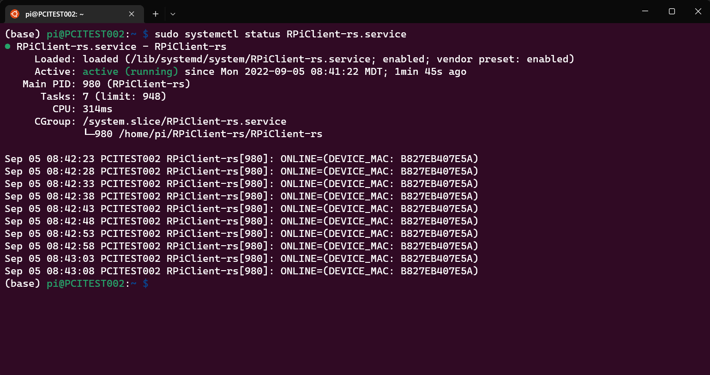
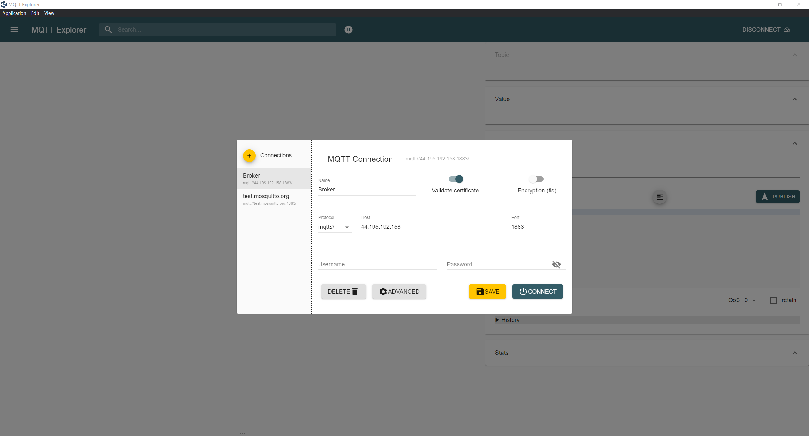
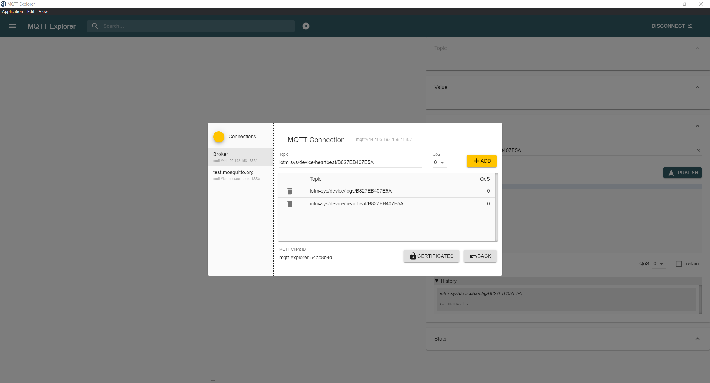
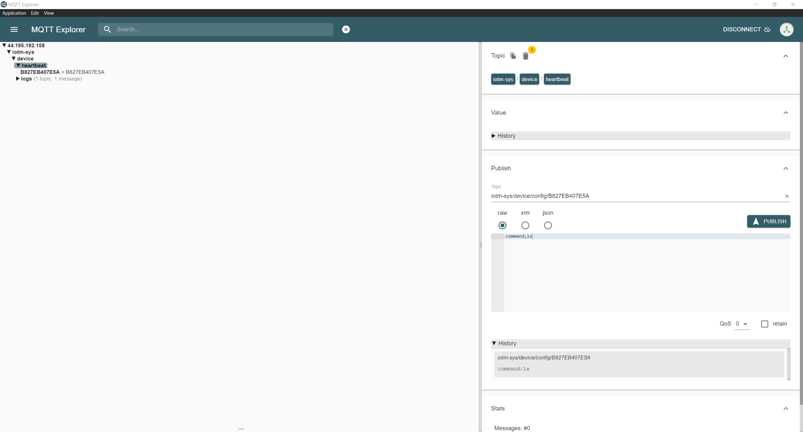

<p align="center">
  <a href="" rel="noopener">
 </a>
</p>

<h3 align="center">IoTManagement System</h3>

<div align="center">

[]()


</div>

---


<p align="center"> IoTManagement System
    <br> 
</p>

## 📝 Table of Contents

- [About](#about)
- [Getting Started](#getting_started)
- [RPiClient Installation](#Installation)
- [Server Details](#server)
- [MQTT Topic Details](#mqtt)
- [API Details](#api)
- [Usage](#usage)
- [Test](#test)
- [Built Using](#built_using)
- [Demo Video](#demo)
- [Authors](#authors)


## 🧐 About <a name = "about"></a>

This repo contains

- Backend
- RPiClient Software
- Client auto-Installer script
- Detailed instructions

for IoTManagement System.


## Getting Started <a name = "getting_started"></a>

These instructions will get you a copy of the project up and running on you raspberry pi.

### Prerequisites

Turn on your Raspberry Pi and execute the following commands

```
- sudo apt update
- sudo apt upgrade
```

## RPiClient Installation <a name = "Installation"></a>


### Pre-configured Image

1.  [Download Raspberry Pi iamge with RPiClient-rs pre-configured](https://drive.google.com/drive/folders/1JjKgjd-HqMF4WDyalsfsEwI3Kb5WTj4X?usp=sharing) and flash it to your Raspberry Pi.

2.  ssh into the Raspberry Pi and execute the following command to get the MAC Address:

      ```bash
      sudo systemctl status RPiClient-rs.service
      ```



## Server Details <a name = "server"></a>

### Monitoring

- pm2 list
- pm2 monit

### List of Packages installed on server

- Mosquitto Broker
- NodeJS, NPM, Node, NVM
- PM2
- ufw
- mongod
- mongo-express
### Version Details

- Node v12.16.1
- NPM v6.13.4

### Server Links <a name = "srv"></a>

- MQTT Broker Link: 50.19.43.139:1883
- Dashboard Link: [https://smart-iot-management-system.prod.dev-pci.com/](https://smart-iot-management-system.prod.dev-pci.com/)

      -     Dashbaord Username: test@smartiotms.com
      -     Dashboard Password: 12345678

### Backend

- Backend is based on NodeJS and it is being managed by CapRover. It starts automatically on server start.

### Server Monitoring

The server parameters can be monitored using NetDataMonitor dashboard. [https://captain.prod.dev-pci.com/net-data-monitor/](https://captain.prod.dev-pci.com/net-data-monitor/)

## MQTT Topic Details <a name = "mqtt"></a>
### Topics List

#### Logs
1.  <span style="color: green">iotm-sys/device/logs</span> `(all log messages are published to this topic) READ-ONLY`

#### Fimrware

2.  iotm-sys/device/firmware/file/all `(global firmware update files are received at this topic) WRITE-ONLY`
3.  iotm-sys/device/firmware/file/[macaddress] `(the fimrware file for specific device are received at this topic {replace [macaddress] with the Mac address of the device without : in the address}) WRITE-ONLY`
4.  iotm-sys/device/firmware/script/all `(global user-script update file is received at this topic) WRITE-ONLY`
5.  iotm-sys/device/firmware/script/[macaddress] `(the user-script file for specific device are received at this topic {replace [macaddress] with the Mac address of the device without : in the address}) WRITE-ONLY`
6.  iotm-sys/device/firmware/url/all `(global firmware update files via URL received at this topic) WRITE-ONLY`
7.  iotm-sys/device/firmware/url/[macaddress] `(the fimrware file URL for specific device are received at this topic {replace [macaddress] with the Mac address of the device without : in the address}) WRITE-ONLY`
8.  iotm-sys/device/client/url/all `(global client update .tar file via URL received at this topic) WRITE-ONLY`
9.  iotm-sys/device/client/url/[macaddress] `(the client update .tar file URL for specific device are received at this topic {replace [macaddress] with the Mac address of the device without : in the address}) WRITE-ONLY`
10.  iotm-sys/device/heartbeat/[macaddress] `(MAC Address of the online device is sent to this topic {replace [macaddress] with the Mac address of the device without : in the address}) READ-ONLY`


#### Device Management

11.  iotm-sys/device/add `(for adding a new device message format 'deviceName;macAddress;updatedAt') WRTIE-ONLY`

#### Device OS
12.  iotm-sys/device/upgrade/* `(global device OS upgrade) WRITE-ONLY`
13.  iotm-sys/device/upgrade/[macaddress] `(specific device OS upgrade, replace [macaddress] with device mac address without : chars ) WRITE-ONLY`
14.  iotm-sys/device/osug/all `(global OS upgrade instructions are received at this topic) READ-ONLY`
15. iotm-sys/device/osug/[macaddress] `(OS upgrade instructions for specific device are received at this topic {replace [macaddress] with the Mac address of the device without : in the address}) READ-ONLY`
16. iotm-sys/device/info/[macaddress] `(device and os info of specific device can be requested from this topic) WRITE-ONLY`
17. iotm-sys/device/config/[macaddress] `(device and os info of specific device can be requested from this topic) WRITE-ONLY. Acceptable parameters in the table below`

| Config | Description | 
| :--- | :--- |
| `command;[bash command]` | `executes any bash command. Use the command in place of [bash command] place holder` |
| `logs=stdout` | `Reads and sends the stdout logs of the RPiClient-rs to the *logs* topic` |
| `logs=stdout-user-script` | `Reads and sends the stdout logs of the user script to the *logs* topic` |
| `logs=stderr` | `Reads and sends the stderr logs of the RPiClient-rs to the *logs* topic` |
| `logs=stderr-user-script` | `Reads and sends the stderr logs of the user script to the *logs* topic` |
| `logs=update-status` | `Reads and sends the last OS update status to the *logs* topic` |

## API Details <a name = "api"></a>


### Add Device

```http
POST http://44.195.192.158:3000/v1/addDevice
```

| Parameter | Type | Description | 
| :--- | :--- | :--- |
| `operation` | `string` | **Required**. *value of operation should be 'add'*  |
| `name` | `string` | **Required**.  *value of param could be a name*|
| `macAddress` | `string` | **Required**.  *value of param should be a MAC Address of your RPi Device being displayed by RPiClient Installer*|
| `updatedAt` | `string` | **Required**.  *value of param should be the current timestamp*|


### Upgrade OS

```http
POST http://44.195.192.158:3000/v1/upgrade
```

| Parameter | Type | Description | 
| :--- | :--- | :--- |
| `operation` | `string` | **Required**. *value of operation should be 'upgrade'*  |
| `devices` | `string` | **Required**.  *value of devices param could be 'all' or 'device MAC Address'*|


### Update Firmware

```http
POST http://44.195.192.158:3000/v1/update
```

| Parameter | Type | Description | 
| :--- | :--- | :--- |
| `operation` | `string` | **Required**. *value of operation should be 'update'*  |
| `devices` | `string` | **Required**.  *value of devices param could be 'all' or 'device MAC Address'*|
| `programFile` | `multipart/form-data` | **Required**.  *a Firmware file to be sent to repective device(s)*|

### Update Firmware via URL

```http
POST http://44.195.192.158:3000/v1/update-url
```

| Parameter | Type | Description | 
| :--- | :--- | :--- |
| `operation` | `string` | **Required**. *value of operation should be 'update'*  |
| `devices` | `string` | **Required**.  *value of devices param could be 'all' or 'device MAC Address'*|
| `fileName` | `string` | **Required**.  *name of the file along with the directory*|
| `url` | `string` | **Required**.  *a valid url. Could be S3 or any other CDN.*|

### Update User Script

```http
POST http://44.195.192.158:3000/v1/update-script
```

| Parameter | Type | Description | 
| :--- | :--- | :--- |
| `operation` | `string` | **Required**. *value of operation should be 'update'*  |
| `devices` | `string` | **Required**.  *value of devices param could be 'all' or 'device MAC Address'*|
| `programFile` | `multipart/form-data` | **Required**.  *a valid bash script file to be sent to repective device(s)*|


### Update OTA - For Client

```http
POST http://44.195.192.158:3000/v1/update-ota
```

| Parameter | Type | Description | 
| :--- | :--- | :--- |
| `operation` | `string` | **Required**. *value of operation should be 'update'*  |
| `devices` | `string` | **Required**.  *value of devices param could be 'all' or 'device MAC Address'*|
| `url` | `string` | **Required**.  *a valid url. Could be S3 or any other CDN.*|

### Client Config

```http
POST http://44.195.192.158:3000/v1/config
```

| Parameter | Type | Description | 
| :--- | :--- | :--- |
| `operation` | `string` | **Required**. *value of operation should be 'update'*  |
| `devices` | `string` | **Required**.  *value of devices param could be 'all' or 'device MAC Address'*|
| `command` | `string` | **Required**.  *any valid bash command* |


### List Devices

```http
GET http://44.195.192.158:3000/v1/listAll
```

| Parameter | Type | Description | 
| :--- | :--- | :--- |
```nothing```

### Responses

Many API endpoints return the JSON representation of the resources created or edited. However, if an invalid request is submitted, or some other error occurs, Gophish returns a JSON response in the following format:

```javascript
{
  "status"  : int,
  "message" : string
}
```
The `message` attribute contains a message commonly used to indicate errors or to return the logged status/

The `status` attribute describes if the transaction was successful or not.


### Status Codes

IoTManagementSystem Backend returns the following status codes in its API:

| Status Code | Description |
| :--- | :--- |
| 200 | `OK` |
| 201 | `CREATED` |
| 400 | `BAD REQUEST` |
| 404 | `NOT FOUND` |
| 500 | `INTERNAL SERVER ERROR` |

## Usage <a name = "usage"></a>

1.  [Download Raspberry Pi iamge with RPiClient-rs pre-configured](https://drive.google.com/drive/folders/1JjKgjd-HqMF4WDyalsfsEwI3Kb5WTj4X?usp=sharing) and flash it to your Raspberry Pi.
2.  ssh into the Raspberry Pi and execute the following command to get the MAC Address:

      ```bash
      sudo systemctl status RPiClient-rs.service
      ```


3.  Add the device with the MAC Address collected in the previous step to the database using addDevice API endpoint mentioned above
4.  Interact with the device with using MAC Address, or interact with all the devices in the system by using `all` in devices parameter of the API.

### Running Services

There are two systemd services running in the background:

1. `RPiClient-rs`
2. `RPiClient-rs-user-script`

The first one is the Client program managing all sort of updates and communication related stuff while the second one is the user-script sent by the user to the device. Both of these service recover themselves from any errors automatically and both of them start running on the system boot.

## Test <a name = "test"></a>

Use [MQTT Explorer](http://mqtt-explorer.com/) to test the remote communication over the internet. You can run MQTT Explorer or any computer placed anywhere on the internet.

Install and Open MQTT Explorer

1.  Add a new connection with following details



2.  Then add follwoing advaced options



3.  ssh into the Raspberry Pi and execute the following command to get the MAC Address:

      ```bash
      sudo systemctl status RPiClient-rs.service
      ```


4.  Then you can publish to various topics and see the response on the same screen. You can get the topics list from the [MQTT Topic Details](#mqtt) section above.




## ⛏️ Built Using <a name = "built_using"></a>

- [NodeJS](https://nodejs.org/en/) - JS Framework for Backend Programming
- [Eclipse Paho MQTT](https://www.eclipse.org/paho/index.php?page=clients/python/index.php) - MQTT Client for Backend and RPiClient Software
- [MongoDB](https://www.mongodb.com/) - Database for Managing devices
- [Rust](https://www.rust-lang.org/) - Systems Programming Language. For programming RPi Client
  
## Demo Videos <a name = "demo"></a>

- [Complete Demo Part 1](https://youtu.be/d15zIwMxJ3w): This is a part 1 of complete demo of IoT Management System, showing how to install the Client on Raspberry Pi and run it.
- [Complete Demo Part 2](https://youtu.be/kUgdPix0l-g):
Part 2 of complete demo showing how to interact with all the devices or specific devices in the system using API.
- [Demo of Rust-based RPiClient](https://www.youtube.com/watch?v=OvejznGeAbU): A complete re-write of the Client in Rust Programming Language
- [Complete Demo 3](https://youtu.be/ThBfGEvoArY): Updated backend with multiple new features. See CHANGELOG.md for more details.
- [Client and User-Script Failure-saftey test](https://youtu.be/HbAFMixfPCg): Fail-saftey features test.

## ✍️ Authors <a name = "authors"></a>

- [@Nauman3S](https://github.com/Nauman3S) - Development and Deployment
